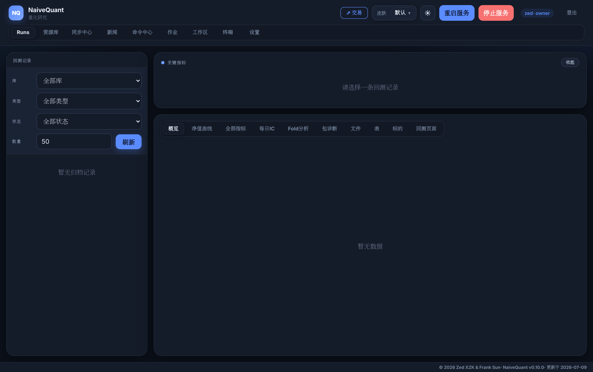
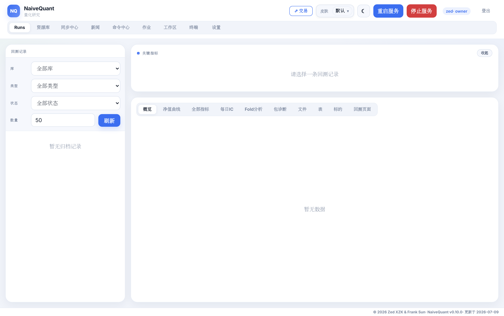

<div align="center">

# NaiveQuant · 模块化量化交易平台

**从因子研究到多市场实盘执行的一体化量化系统**

`Python` · `DuckDB` · `FastAPI` · `Svelte 5` · `PyTorch` · `LangGraph` · `systemd`


-lightgrey)

> 本仓库为**作品展示（Showcase）**，用于介绍平台的架构、能力与工程实践。
> 源码为专有代码、不公开；如需代码走查，可在面试环节提供。

</div>

---

## 一、这是什么

**NaiveQuant** 是我独立设计与实现的一套端到端量化交易平台，覆盖量化投资的完整链路：

```
数据采集 → 因子/ML 研究 → 组合构建 → 策略 → 风控 → 执行下单 → 报告 → 运维监控
```

核心设计是一条 **YAML 驱动的回测/实盘流水线**：数据、Alpha/ML、组合、策略、风控、用户策略、
执行各层通过**统一协议**通信，执行层只消费「最终账户决策」，不内置任何具体交易规则 ——
从而做到策略与执行彻底解耦、研究成果可无缝切换到实盘。

| 维度 | 规模 |
|---|---|
| 代码量 | **95,000+ 行** Python（506 个模块文件） |
| 核心子系统 | **25+** 个顶层包（data / factor / ml / strategy / risk / trading / execution …） |
| 覆盖市场 | 美股、港股、A 股 —— **5 个券商适配器** |
| 部署 | **双云服务器** · systemd 全栈守护 · 6 个常驻服务 |
| 前端 | Svelte 5 研究控制台 + 独立运维监控台 |

### 界面预览

**研究控制台**（Svelte 5 · 回测记录 / 因子库 / 命令中心 / 工作区 / 终端 · 主题自适应）

| 深色主题 | 浅色主题 |
|:---:|:---:|
|  |  |

---

## 二、核心能力

### 📊 数据层 · PIT 正确的多源数据catalog
- **统一 DataCatalog**：`(market, asset_class, datatype)` 三元组寻址，屏蔽底层存储细节。
- **SEC EDGAR 财报采集**：直连 `data.sec.gov` XBRL，**严格区分「财报周期」与「公布日期」**
  （`period_end` vs `filed→available_at`）—— 消除量化研究最常见的前视偏差（look-ahead bias）。
- **7×24 行情录制**：Alpaca 全市场分钟 bar + 观察列表 NBBO quote 高频档案，自建专有数据资产。
- **DuckDB 存储引擎**：针对单写者锁设计「**开→写→关**」写入器，让采集守护写入的同时，
  研究 / Agent 侧可并发只读，互不阻塞。

### 🔬 研究层 · 因子挖掘与机器学习
- **因子引擎**：批量因子计算、去噪（denoise）、截面预处理、滚动 walk-forward 训练评估。
- **ML / 深度学习**：传统模型 + PyTorch 深度模型 + **强化学习**（PPO / DQN 连续仓位控制）。
- **逐位可复现**：确定性种子 + 线程预算统一管控，多进程训练下结果可精确复现。
- **因子/策略库**：DuckDB 支撑的状态机（候选→准入→生产→退役）+ 审计日志。

### 🤖 纯 LLM 投研 · 大模型对冲基金接入
- 集成 **ai-hedge-fund / TradingAgents / Vibe-Trading** 等大模型投研框架，
  接平台自有 catalog 数据（弃用第三方付费数据源），跑通 **19 个分析师 Agent** 的
  基本面 / 估值 / 新闻多角色决策，闭环到纸账户下单。

### 💹 交易层 · 多市场统一执行
- **5 个券商适配器**，同一套协议下切换：

  | 适配器 | 市场 | SDK |
  |---|---|---|
  | Alpaca | 美股 | alpaca-py |
  | Futu / 富途 | 港股 · 美股 | futu-api |
  | IBKR / 盈透 | 全球 | ib_insync |
  | Longbridge / 长桥 | 港股 · 美股 | longport |
  | QMT / miniQMT | A 股 | xtquant |

- **事件驱动实盘**：订单状态流转、对账（reconcile）、mandate 授权审计、保护性熔断、
  持仓时序快照 —— 全部 append-only JSONL 记录（跨进程无写锁）。
- **实盘红线（readiness redline）** 与 dry-run 安全默认：新账户默认模拟 + 不自动下单。

### 🖥️ 运维层 · 生产级部署与监控
- **systemd --user** 全栈守护（linger 常驻、崩溃自愈），服务全绑回环、经 SSH 隧道访问、不暴露公网。
- **独立运维监控台**（FastAPI + Svelte）：统一进程健康视图，与研究控制台职责分离。
- **凭证零明文**：主口令仅注入 systemd 用户管理器内存，密钥加密落盘、内存解密，重启不落盘。
- **一键部署脚本链**：`sync → install → services`，增量 rsync + 冒烟自检。

---

## 三、系统架构

严格的**自下而上分层依赖**（无跨层反向违规、无循环依赖），详见 [ARCHITECTURE.md](ARCHITECTURE.md)：

```
L5 交互层     UI(研究台/运维台) · CLI · 报告 · 可视化
L4 编排层     ML流水线 · 回测 · 工作流 · 选股 · 优化 · 策略池
L3 领域层     因子族  ‖  策略族  ‖  交易族(执行/账户/组合/风控)   ← 三族平行、互不依赖
L2 数据/模型  数据引擎 · 财报/基本面 · 数据providers · 模型(RL/深度/确定性) · 认证
L1 core 基础  schemas · secrets · settings · workspace · data_catalog · protocols
L0 叶子       constants · logger · config
─────────────
独立包        trading_server  ──单向──►  quantplatform.*   （严格单向，4 个稳定门面收敛）
```

---

## 四、工程质量实践

这套平台不仅是「能跑」，更强调**可维护性与工程规范**：

- **模块耦合治理**：定期做全量依赖图审查，识别枢纽模块、消除跨包私有依赖
  （例：把 `trading_server` 对内部私有实现的深钻依赖收口为**公开门面**）。
- **重复代码重构**：系统化去重 —— 纯语言级工具沉 `core/`、带 DuckDB 语义沉 `data/`、
  带 broker 语义留 `trading/brokers/`，并对已语义漂移的实现做**参数化合并**而非裸合并，
  保证**零外部行为变更**。
- **版本与变更纪律**：每次提交同步 `version.py` + `docs/update-log.md`，语义化版本，
  变更记录可追溯到每一个 commit。
- **测试**：pytest 分域测试子集（data / factor / models / brokers / backtest / trading_server）。
- **设计文档**：关键子系统（事件驱动实盘、通知子系统、运维记录、standalone 推断 vendoring 等）
  均有独立设计文档。

---

## 五、技术栈

| 层面 | 技术 |
|---|---|
| 语言 | Python 3.13 |
| 数据 | DuckDB · pandas · pyarrow |
| 存储寻址 | 自研 DataCatalog（市场/资产类/数据类型三元组） |
| Web / API | FastAPI · uvicorn |
| 前端 | Svelte 5（`$state`/`$derived` runes）· Vite |
| 机器学习 | scikit-learn · PyTorch · 自研 RL（PPO/DQN） |
| LLM 投研 | LangChain · LangGraph · DeepSeek / Claude |
| 券商 | alpaca-py · futu-api · ib_insync · longport · xtquant |
| 部署 | Linux · systemd(--user) · SSH 隧道 · rsync 部署链 |

---

## 六、关于源码

本项目采用**严格的专有授权**，源码不公开。本 Showcase 展示的是架构、能力与工程实践。

📮 如需进一步了解 —— 完整代码走查、某个子系统的实现细节、设计取舍讨论 —— 欢迎在面试中沟通，
可现场演示与讲解。

<div align="center">

**作者：Zed XZK**

📮 xizhikun@outlook.com · zedxzk@163.com

</div>
