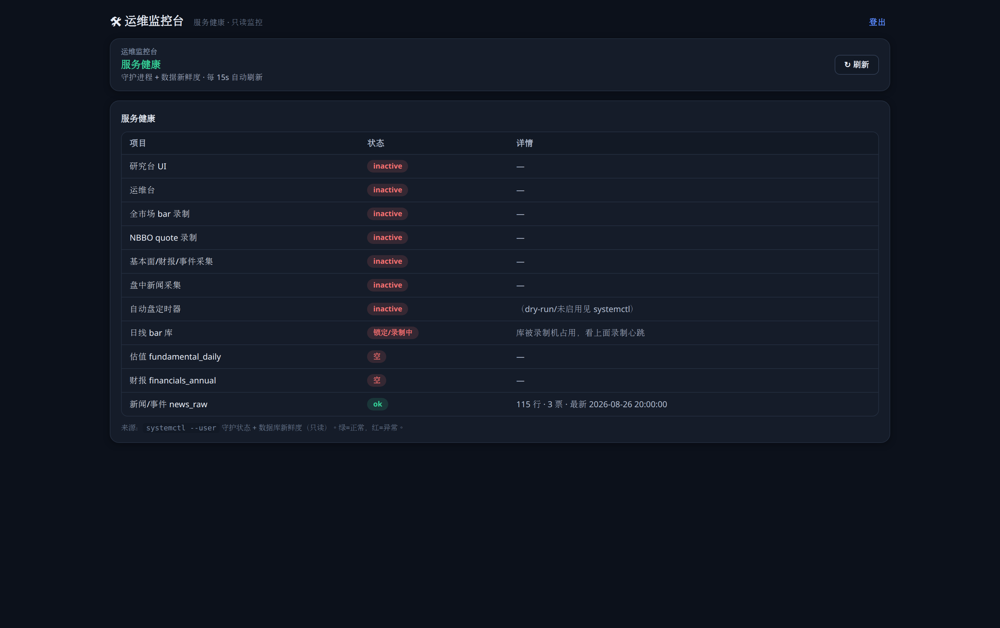

<div align="center">

# NaiveQuant · 量化交易平台 Showcase

**一个覆盖研究、回测、执行和运维的个人量化系统**

`Python` · `DuckDB` · `FastAPI` · `Svelte 5` · `PyTorch` · `LangGraph` · `systemd`


-lightgrey)

> 这是一个作品展示仓库，用来说明 NaiveQuant 的架构、功能范围和一些工程实现。
> 源码暂不公开；如果需要代码走查，可以在面试或技术交流时现场展开。

</div>

---

## 一、项目概况

**NaiveQuant** 是我独立设计和实现的量化交易平台。它不是单个策略脚本，而是围绕日常投研和实盘运维搭的一套系统：

```
数据采集 → 因子/ML 研究 → 组合构建 → 策略 → 风控 → 执行下单 → 报告 → 运维监控
```

系统围绕一条 **YAML 驱动的回测/实盘流水线**来组织。数据、Alpha/ML、组合、策略、风控、用户策略和执行层之间通过统一协议衔接。执行层只接收最终生成的账户决策，无需关心策略内部如何产生信号；这样研究代码与下单代码可以分开维护，策略从回测切换到纸账户或实盘时，也大大减少了粘合代码的改动量。

| 维度 | 规模 |
|---|---|
| 代码量 | **95,000+ 行** Python（506 个模块文件） |
| 核心子系统 | **25+** 个顶层包（data / factor / ml / strategy / risk / trading / execution 等） |
| 覆盖市场 | 美股、港股、A 股；目前有 **5 个券商适配器** |
| 部署 | 两台云服务器，systemd 守护，6 个常驻服务 |
| 前端 | Svelte 5 研究控制台 + 独立运维监控台 |

### 界面预览

**研究控制台**：回测记录、因子库、命令中心、工作区、终端，支持深浅色主题。

| 深色主题 | 浅色主题 |
|:---:|:---:|
|  |  |

**运维监控台**：独立服务，用来看守护进程状态、数据新鲜度和数据库锁状态，每 15 秒刷新。



> 上图来自本地演示环境，因此守护服务显示为 `inactive`。生产服务器上 6 个常驻服务均正常在线。
> 此页面仅提供只读汇总，不直接修改服务状态。

---

## 二、主要功能

### 数据层：PIT 正确的多源数据目录

- **统一 DataCatalog**：用 `(market, asset_class, datatype)` 三元组寻址，业务代码无需直接关注底层文件与表结构。
- **SEC EDGAR 财报采集**：直连 `data.sec.gov` XBRL，同时保存财报周期和公布时间（`period_end` vs `filed→available_at`），避免将尚未公布的数据引入历史回测（防止前视偏差）。
- **行情录制**：录制 Alpaca 全市场分钟 bar，以及观察列表里的 NBBO quote 高频数据，保存自己的历史样本。
- **DuckDB 存储**：针对单写者限制实现了短事务写入器，采集进程写完即关闭连接，研究端可并发只读。

### 研究层：因子、模型和策略库

- **因子引擎**：批量计算、去噪、截面预处理、滚动 walk-forward 训练和评估。
- **机器学习**：传统模型、PyTorch 深度模型，以及 PPO / DQN 这类连续仓位控制实验。
- **可复现训练**：统一随机种子和线程预算，尽量减少多进程训练里的随机漂移。
- **因子/策略库**：用 DuckDB 维护候选、准入、生产、退役状态，并保留审计日志。

### LLM 投研：接入外部多 Agent 框架

平台接入过 **ai-hedge-fund / TradingAgents / Vibe-Trading** 等大模型投研框架。改造重点在数据源：尽可能让这些框架改用平台自有 catalog 数据，而非继续依赖第三方付费数据源。目前已能运行 19 个分析师 Agent 的基本面、估值、新闻等多角色流程，并将结果送入纸账户下单。

### 交易层：多市场统一执行

同一套执行协议下接了 5 个券商适配器：

| 适配器 | 市场 | SDK |
|---|---|---|
| Alpaca | 美股 | alpaca-py |
| Futu / 富途 | 港股 · 美股 | futu-api |
| IBKR / 盈透 | 全球 | ib_insync |
| Longbridge / 长桥 | 港股 · 美股 | longport |
| QMT / miniQMT | A 股 | xtquant |

- **事件驱动实盘**：订单状态、对账、mandate 授权审计、保护性熔断、持仓快照都写成 append-only JSONL，方便跨进程记录，也避免争用数据库写锁。
- **默认安全**：新账户默认模拟或 dry-run，未明确配置时不会自动下单。
- **实盘检查**：用 readiness redline 汇总关键开关，避免凭证、账户、风控配置没准备好时误入实盘路径。

### 运维层：部署和监控

- **systemd --user 守护**：开启 linger 后免登录常驻，服务崩溃后自动重启。
- **内网访问**：服务绑定 `127.0.0.1`，通过 SSH 隧道访问，不直接暴露公网端口。
- **独立运维监控台**：FastAPI + Svelte，和研究控制台分开部署。
- **凭证处理**：主口令只注入 systemd 用户管理器内存；密钥加密落盘，需要时解密到内存。
- **部署脚本**：`sync → install → services`，基于增量 rsync，并带简单的冒烟自检。

---

## 三、系统架构

依赖关系按自下而上的方向组织，详细说明见 [ARCHITECTURE.md](ARCHITECTURE.md)：

```
L5 交互层     UI(研究台/运维台) · CLI · 报告 · 可视化
L4 编排层     ML流水线 · 回测 · 工作流 · 选股 · 优化 · 策略池
L3 领域层     因子族  ‖  策略族  ‖  交易族(执行/账户/组合/风控)
L2 数据/模型  数据引擎 · 财报/基本面 · 数据providers · 模型(RL/深度/确定性) · 认证
L1 core 基础  schemas · secrets · settings · workspace · data_catalog · protocols
L0 叶子       constants · logger · config
─────────────
独立包        trading_server  ──单向──►  quantplatform.*
```

`trading_server` 是单独的服务包，只依赖 `quantplatform` 暴露出来的稳定入口；`quantplatform` 不反向导入它。这样服务端改动与研究平台内部重构不会相互阻塞。

---

## 四、工程实践

这套平台花了不少精力在"长期可维护性"上，而不只是把策略跑起来：

- **依赖边界检查**：定期审查全量依赖图，重点处理核心模块、跨包私有依赖以及潜在的循环导入。
- **重复代码整理**：纯语言级工具放到 `core/`，带 DuckDB 语义的放到 `data/`，带 broker 语义的留在 `trading/brokers/`。对于语义已分化的代码不会强行合并，而是先将差异参数化。
- **版本和变更记录**：提交时同步维护 `version.py` 和 `docs/update-log.md`，便于追溯每次结构性变更。
- **测试**：pytest 按 data / factor / models / brokers / backtest / trading_server 等域拆分测试子集。
- **设计文档**：事件驱动实盘、通知、运维记录、standalone 推断 vendoring 等子系统有单独设计记录。

---

## 五、技术栈

| 层面 | 技术 |
|---|---|
| 语言 | Python 3.13 |
| 数据 | DuckDB · pandas · pyarrow |
| 存储寻址 | 自研 DataCatalog（市场/资产类/数据类型三元组） |
| Web / API | FastAPI · uvicorn |
| 前端 | Svelte 5（`$state`/`$derived` runes）· Vite |
| 机器学习 | scikit-learn · PyTorch · 自研 RL（PPO/DQN） |
| LLM 投研 | LangChain · LangGraph · DeepSeek / Claude |
| 券商 | alpaca-py · futu-api · ib_insync · longport · xtquant |
| 部署 | Linux · systemd(--user) · SSH 隧道 · rsync 部署链 |

---

## 六、源码说明

这个仓库只做 Showcase，源码目前不公开。这里展示的是系统结构、功能范围和一些关键实现思路。

如需查看完整代码、某个子系统的实现细节，或讨论具体设计取舍，可在面试或技术交流时现场演示。

<div align="center">

**作者：Zed XZK**

xizhikun@outlook.com · zedxzk@163.com

</div>
