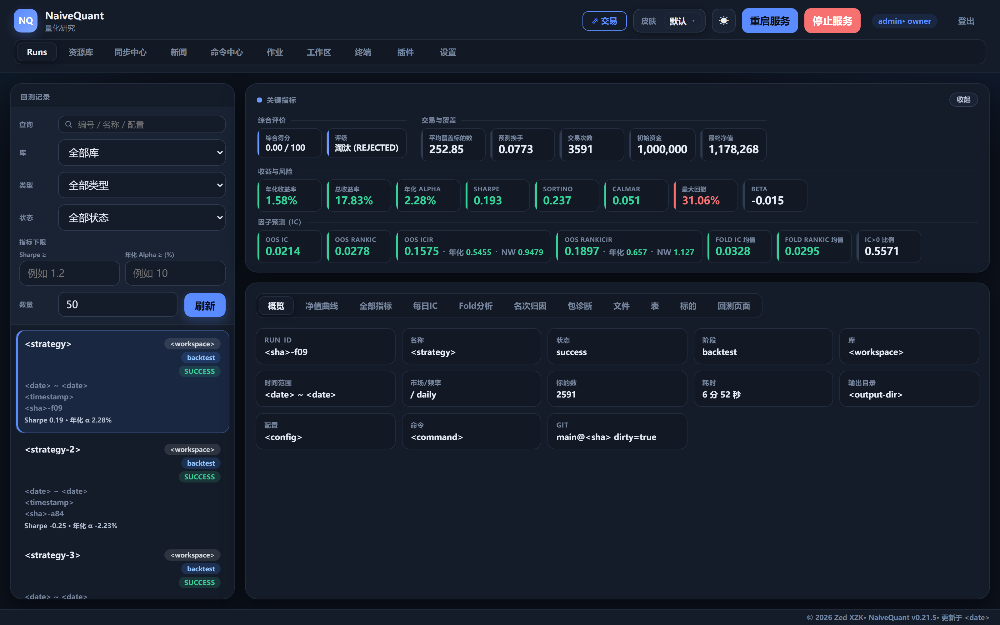
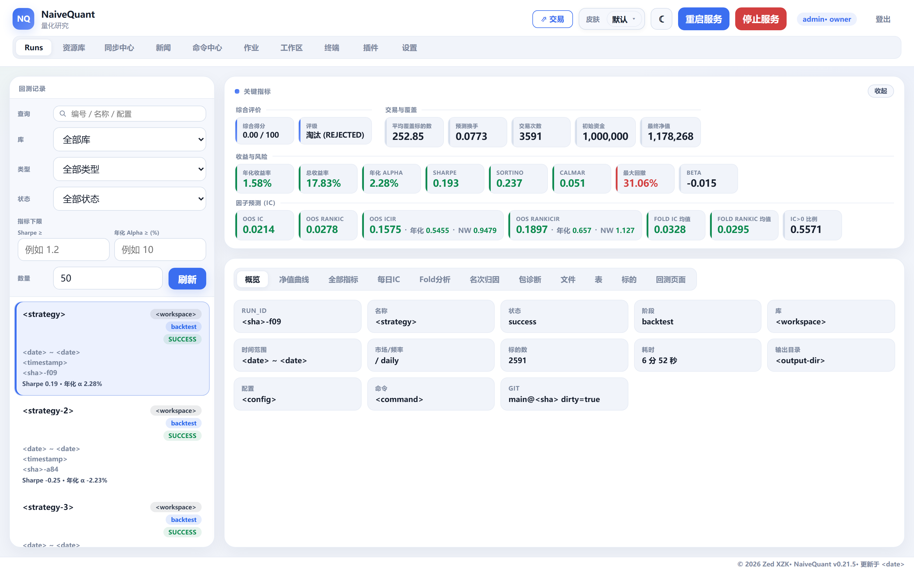
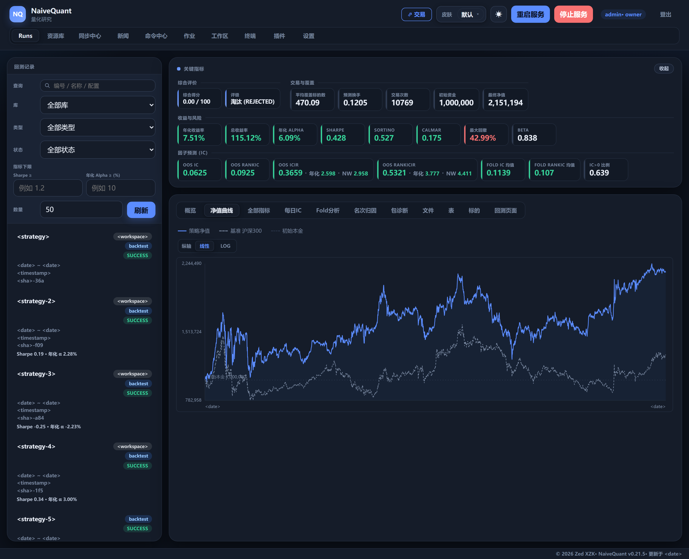
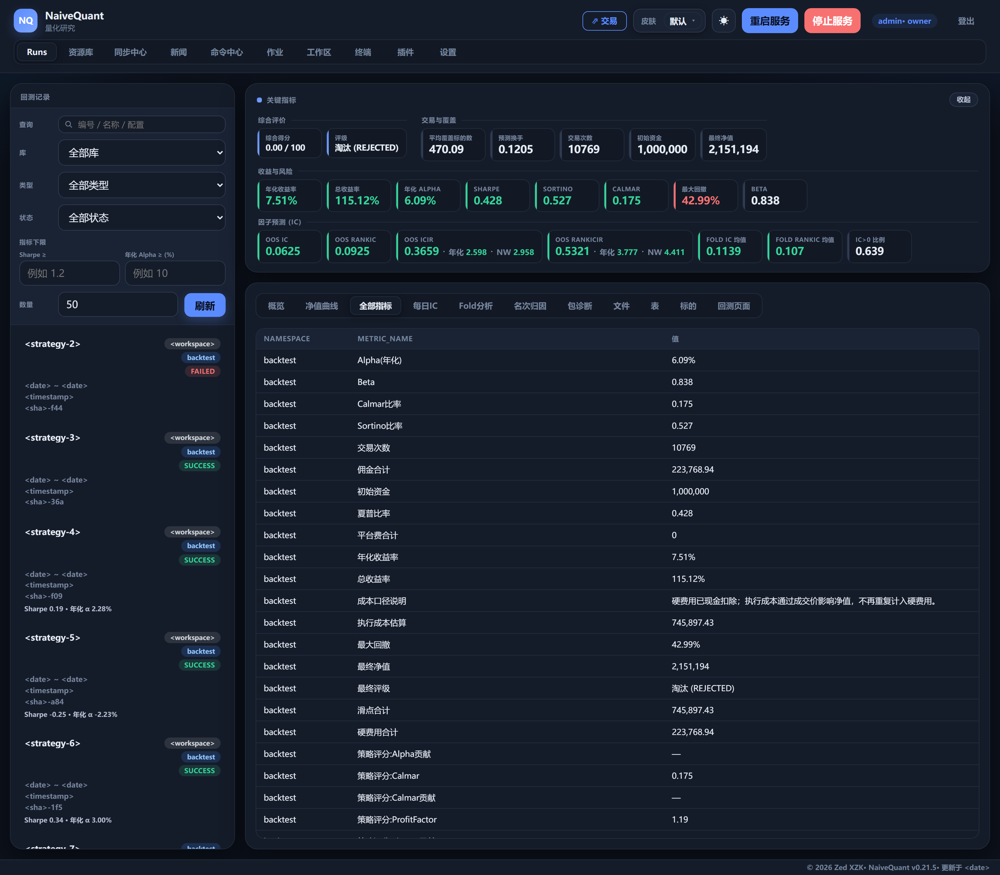
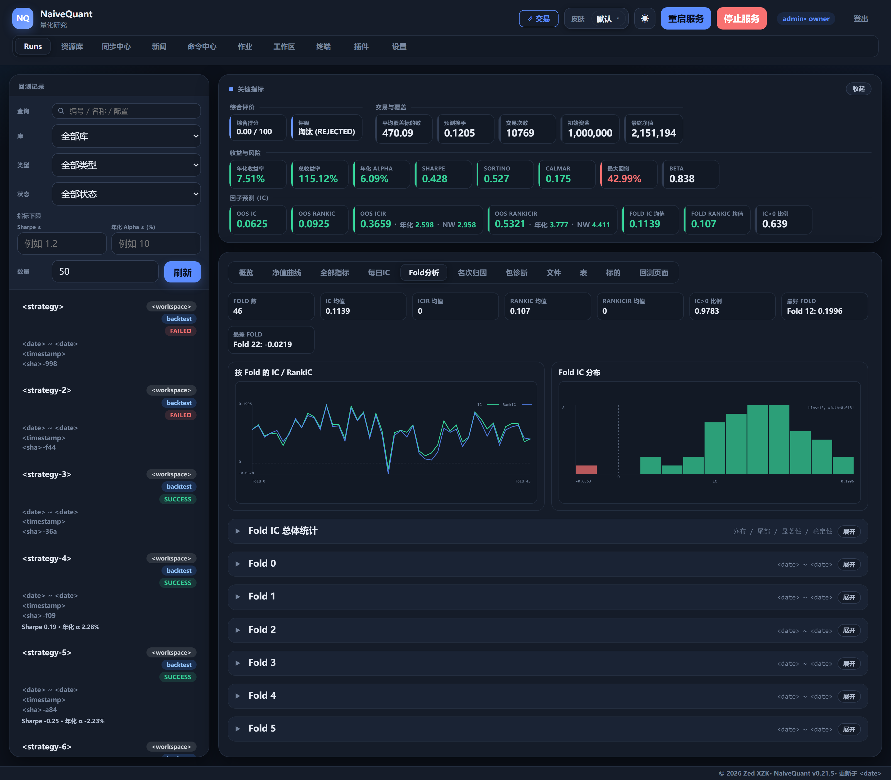
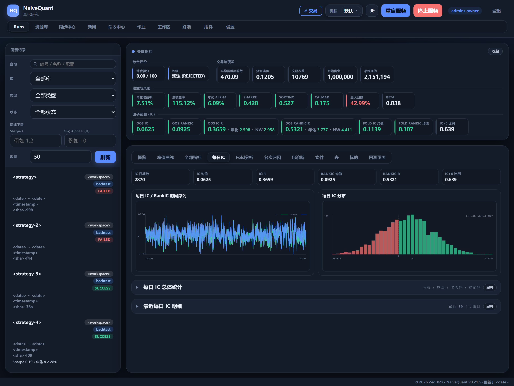
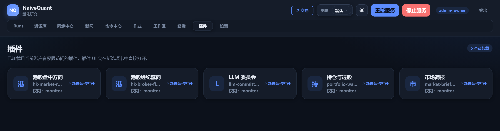
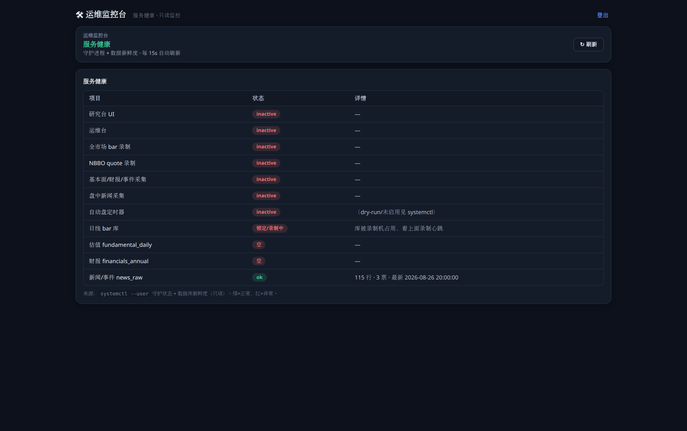

<div align="center">

# NaiveQuant · 量化交易平台 Showcase

**集研究、回测、执行与运维于一体的个人量化系统**

`Python` · `DuckDB` · `FastAPI` · `Svelte 5` · `PyTorch` · `LangGraph` · `systemd`


-lightgrey)

> 这是一个作品展示仓库，用于展示 NaiveQuant 的架构、功能范围和一些工程实现。
> 源码暂不公开；如需查看代码，可在面试或技术交流时现场演示。

</div>

---

## 一、项目概况

**NaiveQuant** 是我独立设计和实现的量化交易平台，覆盖从数据采集到实盘运维的完整链路：

```
数据采集 → 因子/ML 研究 → 择时/组合构建 → 策略 → 风控 → 执行下单 → 报告 → 运维监控
```

系统以一条 **YAML 驱动的回测/实盘流水线**为骨架。0.16 之后，回测入口支持**完整的显式 DAG**：节点通过带版本的 artifact 协议连接，编译期即校验类型、schema、作用域和拓扑环；旧的平铺 YAML 由 legacy compiler 兼容运行。执行层只接收最终生成的账户决策，无需关心策略内部如何产生信号；由此，研究代码与下单代码可以分开维护，策略从回测切换到纸账户或实盘时，粘合代码的改动量也大幅减少。

| 维度 | 规模 |
|---|---|
| 代码量 | **216,000+ 行** Python（1,060+ 个模块文件）+ 约 **18,000 行** Svelte / JS 前端 |
| 构成 | 核心平台 116k · 插件 41k · 测试 37k · 脚本工具 13k · 独立服务 8k |
| 核心子系统 | **29** 个顶层包（data / factor / ml / timing / strategy / portfolio / risk / policy / execution / trading 等） |
| 测试 | 163 个测试文件、**1,570+** 个用例，按域拆分子集 |
| 依赖红线 | **19** 条 import-linter 分层契约，随 lint 强制执行 |
| 覆盖市场 | 美股、港股、A 股（含 A 股 L2 逐笔/盘口）；**5 个券商适配器** |
| 插件 | **7** 个白名单治理插件，启停零代码改动 |
| 部署 | 云服务器 systemd `--user` 常驻，16 个 unit（常驻服务 + 定时任务） |
| 前端 | Svelte 5 研究控制台（24 个功能页）+ 独立运维监控台 |

### 界面预览

> 截图中的工作区名、策略名、日期时间、本地路径、输出目录和 git 提交号已替换为
> `<workspace>`、`<strategy>`、`<date>` 等占位符。指标数值、图表、页面结构和版本号未作改动。

下面几张图来自同一次回测运行：**A 股日频 ML 横截面策略，5,418 只标的、2015–2025、10,769 笔成交**。

**① 运行概览**：左侧是可按库/类型/状态/Sharpe/Alpha 过滤的运行列表，右侧汇总综合评级、收益与风险、以及因子预测的 OOS IC / RankIC / ICIR。支持深浅色主题。

| 深色主题 | 浅色主题 |
|:---:|:---:|
|  |  |

**② 净值曲线**：策略净值、基准（沪深 300）与初始本金三线对照，可切线性/对数纵轴。这次运行总收益 115.12%、年化 7.51%、年化 Alpha 6.09%。



**③ 全部指标**：完整指标账本。除常规收益风险指标外，执行成本分项列出——价差成本、佣金、市场冲击、平台费、滑点、规费税费各自独立成行，并注明成本口径：硬费用现金扣除，执行成本通过成交价影响净值，两者不重复计入。



**④ Walk-forward Fold 分析**：这次运行切了 **153 个 fold**，逐 fold 记录 IC / RankIC，并给出 fold IC 分布直方图、最好与最差 fold、以及分布/尾部/显著性/稳定性四类总体统计。每个 fold 的训练与测试窗口都可展开核对。



**⑤ 每日 IC**：3,197 个交易日的 IC / RankIC 时间序列与分布，附 ICIR、RankICIR 和 IC>0 比例。



> **关于评级**：这次运行的最终评级是 **淘汰 (REJECTED)**，综合得分 0.00/100，原因写在评分详情里：「触发底线：最大回撤超过 25.0%」（实际 42.99%）。
> 风险底线在评分体系里是硬约束，先于收益指标判定——底线触发即淘汰，收益部分不再计入总分。

**⑥ 插件页**：只列出已加载且当前账户有权限访问的插件；未启用或版本不兼容的插件不会静默隐藏，而是在运维台标记为 error。



**运维监控台**：独立服务，用于查看守护进程状态、数据新鲜度、系统资源遥测和数据库锁状态。



> 运维台截图来自本地演示环境，因此守护服务显示为 `inactive`；生产服务器上各常驻服务均正常在线。
> 该页面提供只读汇总，以及受 RBAC + TOTP 保护的有限控制操作。

---

## 二、主要功能

### 数据层：支持 Point-in-Time 的多源数据目录

- **统一 DataCatalog**：用 `(market, asset_class, datatype)` 三元组寻址，业务代码无需直接操作底层文件与表结构；物理布局集中声明在 `config/data_catalog/`，覆盖 A 股 / 港股 / 美股的 bars、L2 逐笔与盘口、指数、期指等数据集。
- **SEC EDGAR 财报采集**：直连 `data.sec.gov` XBRL，同时保存财报周期和公布时间（`period_end` vs `filed→available_at`），避免将尚未公布的数据混入历史回测（防止前视偏差）。
- **行情采集**：录制 Alpaca 全市场分钟 bar、观察列表的 NBBO quote 高频数据，以及港股日线与 A 股 L2 数据，积累自有历史样本。
- **仿射复权（A/B）**：0.21 起统一复权公式为 `adjusted = raw × A + B`。港股的 A/B 由 Futu 官方 `get_rehab` 事件按倒序语义组合得到，替代此前按前收盘比值推算的做法；现金分红与拆并股由此落在同一条复权链上，与官方 HFQ 抽样对账的相对误差约 5ppm。A 股、美股的单比例数据以 `B=0` 兼容。
- **DuckDB 存储**：针对 DuckDB 的单写者限制，实现了短事务写入器，采集进程写入完毕后立即释放连接，研究端可并发只读；可更新库与静态研究库分别控制只读句柄复用，采集时不必停掉整个研究服务。

### 研究层：因子、模型、时序择时

- **Pipeline DAG**：`pipeline.graph.nodes` 支持多节点、多个同类 provider，加载期就拒绝重复 ID、未知 provider、缺失输入、类型/schema 不匹配、循环、非法 scope 和缺失 execution sink；产物带稳定 identity 并进入通用 artifact cache。
- **因子引擎**：批量计算、去噪、截面预处理、滚动 walk-forward 训练和评估。
- **机器学习**：传统模型、PyTorch 深度模型，以及 PPO / DQN 这类连续仓位控制实验。
- **时序择时**：顶层 `timing` 领域统一日频、bar 和事件时钟，公共 provider 只有一个，市场差异交给数据路由与执行节点。带 **fail-closed 验证闸门**——加权 OOS R²、Top 桶净收益、命中率、持久性和有效样本量任一不达标，就不产生入场决策。
- **可复现训练**：统一随机种子和线程预算，尽可能降低多进程训练中的随机性差异。
- **运行归档**：每次回测 / 因子挖掘 / 可视化研究都把配置、命令、标的、指标、权重、账户决策、成交和报告落进归档库，可用 `nquant db repro <run_id>` 复原当时的运行条件。
- **因子/策略库**：用 DuckDB 维护候选、准入、生产、退役状态，并保留审计日志。

### LLM 投研：从"接外部框架"到"内置委员会"

早期直接改造 **ai-hedge-fund / TradingAgents / Vibe-Trading** 等外部多 Agent 框架，把数据源切换到平台自有 catalog。目前这条链路已经沉淀为内置的 `llm-committee` 插件：**19 个分析师 Agent**（价值、成长、估值、技术、情绪、新闻、风控、组合经理等）、风险管理与组合决策全部是插件内部模块，不再依赖任何 vendor checkout。

聚合由 `quantplatform.committee` 负责：稳定性校准、分歧度量、决策区间与黏性控制。每个 Agent 的稳定性表按 `provider::model` 索引；缺少当前模型的专属样本时回退到聚合值，并在报告里标记回退来源。输出只是目标权重和最新价，下单、dry-run、paper/live、对账和熔断全部沿用平台既有链路。

### 交易层：多市场统一执行

基于同一套执行协议，已对接 5 个券商适配器：

| 适配器 | 市场 | SDK |
|---|---|---|
| Alpaca | 美股 | alpaca-py |
| Futu / 富途 | 港股 · 美股 | futu-api |
| IBKR / 盈透 | 全球 | ib_insync |
| Longbridge / 长桥 | 港股 · 美股 | longport |
| QMT / miniQMT | A 股 | xtquant |

- **事件驱动实盘**：订单状态、对账、mandate 授权审计、保护性熔断、持仓快照均采用 append-only JSONL 格式写入，便于跨进程协同记录，也避免了与数据库竞争写锁。
- **L2 事件执行**：A 股逐笔/盘口链路按一档 participation 上限与整手约束计算开仓数量，严格 T+1 退出时再次检查盘口容量、可成交时间窗、成本和实际持仓；相关数据缺失时拒绝成交。
- **默认不下单**：新账户默认模拟或 dry-run；未明确配置实盘参数时不会真实下单。
- **实盘检查**：通过就绪红线（readiness redline）汇总关键开关，避免凭证、账户、风控配置未就绪时误入实盘路径。

### 插件体系：功能扩展与治理边界

平台用一份白名单 YAML 治理插件，**启停零代码改动、`git diff` 可查、运维台可见**。契约是单向的：插件 import 平台公开 API，平台永不 import 插件（按名动态加载）；依赖自带隔离；启用但未安装或版本不兼容时 **fail-closed**，直接报错而不是静默降级。

| 插件 | 作用 |
|---|---|
| `portfolio-watch` | 多市场同源指标选股、加密持仓研究、衍生品覆盖反查、轮证街货比与只读调仓论证 |
| `llm-committee` | LLM 委员会 Live 信号 provider（19 Agent + 稳定性校准） |
| `hk-broker-flow` | 港股经纪商流向：OpenD 白名单采集 + 研究回放 + 运维管理 |
| `hk-market-regime` | 港股盘中方向：指数、市场宽度、期指为主，经纪流作为新鲜度与覆盖率门控的确认因子 |
| `market-briefing` | 跨市场（韩股 / A 股 / 港股）行情简报，纯数据 + 可选轻量 LLM 总结，无交易决策权限 |
| `notifications` | 可靠通知投递常驻服务；监控与交易模块只负责产出事件 |
| `system-monitor` | 主机、服务、采集器、磁盘、网络和 IO 的统一只读资源遥测 |

### 运维层：部署、鉴权和监控

- **systemd --user 守护**：开启 linger 后免登录常驻，服务崩溃后自动重启；16 个 unit 覆盖研究台、运维服务、各插件常驻进程和定时采集任务。
- **多用户鉴权**：`quantplatform/auth/` 是研究台与运维台**共用**的安全基座——鉴权（token / 签名会话）、授权（RBAC 三层 + 权限集合 + TOTP + 四眼审批）、作用域（部署级 vs 个人设置、per-user 密钥目录、交易凭证命名空间）三层正交叠加，落盘文件一律原子写 `0600`，并留访问审计。
- **内网访问**：服务绑定 `127.0.0.1`，通过 SSH 隧道访问，不直接暴露到公网。
- **独立运维监控台**：FastAPI + Svelte，和研究控制台分开部署，避免服务操作绕过登录与 RBAC 边界。
- **凭证处理**：主口令仅注入 systemd 用户管理器内存；密钥加密落盘，按需解密到内存。
- **通用加密同步层**：与业务无关的信封加解密原语，因子、策略、风控等模块各自封装 payload 后复用同一套密钥管理。
- **部署脚本**：`sync → install → services`，基于增量 rsync；部署主机限定在受管服务器列表内（列表外主机在建立网络连接前即被拒绝），安装后执行冒烟自检与版本核对。

---

## 三、系统架构

依赖关系自下而上组织，详细说明见 [ARCHITECTURE.md](ARCHITECTURE.md)：

```
L5 交互层     UI(研究台/运维台) · CLI · 报告 · 可视化 · scheduler
L4 编排层     ML流水线 · 回测DAG · 工作流 · 选股 · 优化 · 运行归档
L3 领域层     因子族  ‖  策略/组合/风控/policy 族  ‖  交易族(execution·account·trading)
              └──────────── timing 时序择时领域 ────────────┘
L2 数据/模型  数据引擎 · 财报/基本面 · 数据providers · 模型(RL/深度/确定性) · stats · auth
L1 core 基础  schemas · protocols · artifacts · registry · pipeline_graph ·
              secrets · settings · workspace · data_catalog · secure_bundle
L0 零依赖层   constants · logger · config
─────────────
独立服务包    trading_server  ──单向──►  quantplatform.*
插件          plugins/*       ──单向──►  quantplatform 公开 API（平台永不反向 import）
```

`trading_server` 是单独的服务包，只依赖 `quantplatform` 暴露出来的稳定接口；`quantplatform` 不反向导入它。从而服务端改动与研究平台内部重构互不影响。

---

## 四、工程实践

围绕长期可维护性做的一些约束和工具：

- **依赖红线可执行**：19 条 import-linter 分层契约写进 `pyproject.toml`，由 `lint-imports` 强制执行——`core` 不得向上依赖、`auth` 只依赖 `core`、计算层不得依赖呈现/入口层等。少量兼容 shim 显式列入白名单并注明原因，实现代码不使用这些边。
- **重复代码整理**：纯语言级工具归入 `core/`，带 DuckDB 语义的归入 `data/`，带 broker 语义的留在 `trading/brokers/`。对于语义已经分化的代码，不会强行合并，而是先将差异参数化。
- **兼容边界明确**：大型入口保留稳定 façade，具体职责拆成可独立测试的模块；旧路径通过 re-export 或延迟属性解析指向同一实现对象，但兼容 façade 不增加业务分支；确认无用的旧实现直接删除，不保留转发。
- **版本和变更记录**：提交时同步维护版本常量和 `docs/update-log.md`，按 Added / Changed / Fixed / Tests / Notes 记录；0.14.x 及更早已按次版本系列归档。
- **文档一致性检查**：`scripts/check_docs.py` 全量校验本地链接与 Markdown anchor、平台与插件版本一致性、文档索引覆盖、设计/归档状态标识、环境变量和关键数量事实。
- **测试**：163 个测试文件、1,570+ 用例，pytest 按 data / factor / models / brokers / backtest / timing / plugins / trading_server 等域拆分子集。
- **设计文档**：事件驱动实盘、多用户鉴权、通知、磁盘与资源监控、数据目录、加密同步、独立推理模块依赖固化（vendoring）等子系统均有独立设计文档。

---

## 五、技术栈

| 层面 | 技术 |
|---|---|
| 语言 | Python 3.13 |
| 数据 | DuckDB · pandas · pyarrow · SQLite（遥测） |
| 存储寻址 | 自研 DataCatalog（市场/资产类/数据类型三元组） |
| 流水线 | 自研版本化 artifact 协议 + DAG 编译器 / 拓扑 runner / artifact cache |
| Web / API | FastAPI · uvicorn |
| 前端 | Svelte 5（`$state`/`$derived` runes）· Vite |
| 机器学习 | scikit-learn · PyTorch · 自研 RL（PPO/DQN） |
| LLM 投研 | LangChain · LangGraph · DeepSeek / Claude / OpenAI Responses |
| 券商 | alpaca-py · futu-api · ib_insync · longport · xtquant |
| 质量保障 | pytest · ruff · import-linter · 自研文档一致性检查 |
| 部署 | Linux · systemd (--user) · SSH 隧道 · rsync 部署链 |

---

## 六、源码说明

本仓库仅作为 Showcase，源码目前不公开。这里展示的是系统结构、功能范围和一些关键实现思路。

如需查看完整代码、某个子系统的实现细节，或讨论具体设计取舍，可在面试或技术交流时现场演示。

<div align="center">

**作者：Zed XZK**

xizhikun@outlook.com · zedxzk@163.com

</div>
